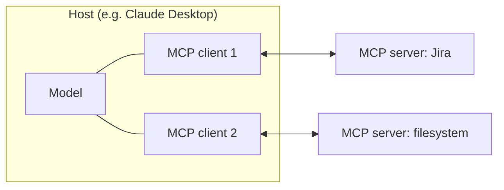
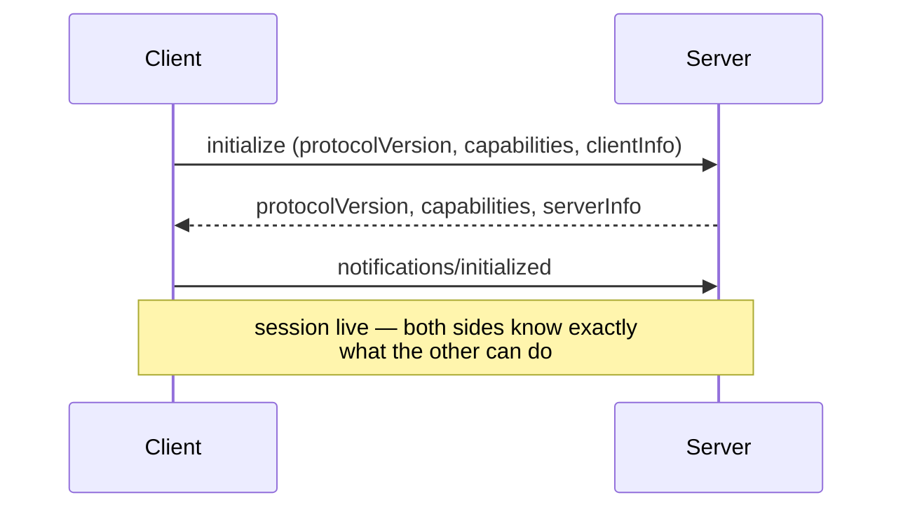
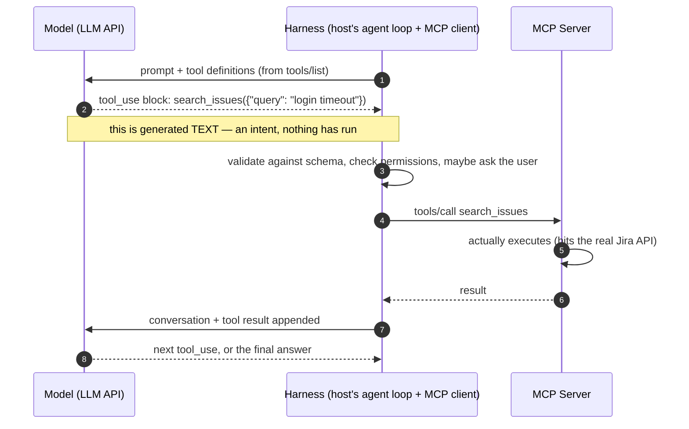
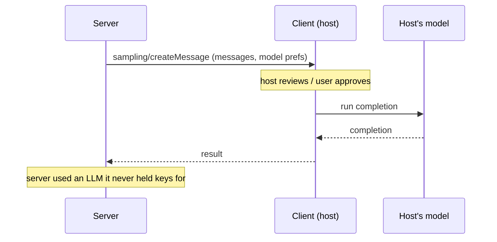
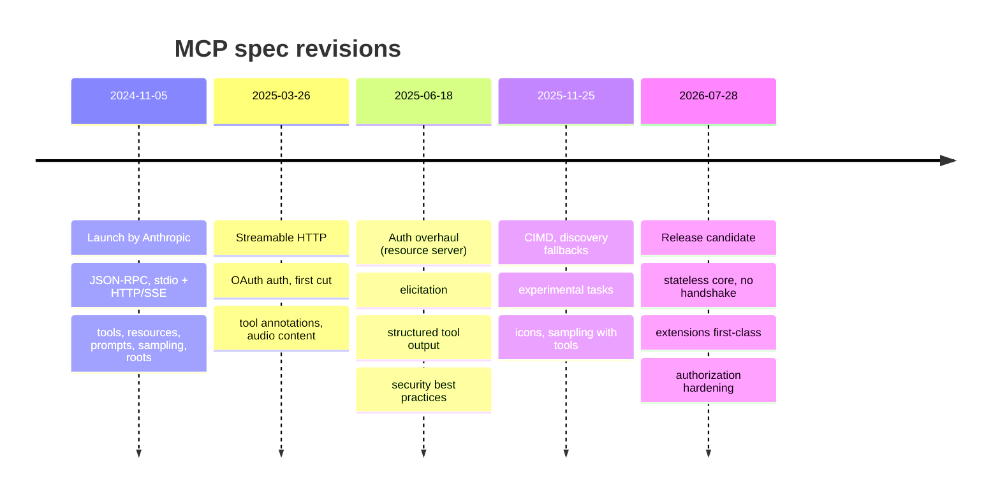

+++
date = '2026-07-04T10:00:00+02:00'
draft = true
title = 'How MCP Works: What It Exposes, How It Talks, and How It Got Here'
author = "Darek Dwornikowski"
categories = ["AI & Engineering"]
tags = ["mcp", "ai", "agents", "engineering"]
description = "A ground-up explainer of the Model Context Protocol: the host-client-server model, the primitives servers and clients expose to each other (tools, resources, prompts, sampling, elicitation), the transports, and the protocol's evolution from the 2024 launch to the 2026 release candidate."
+++

Every AI application eventually hits the same wall: the model is smart, but it is locked in a box. It cannot see your Jira board, your database, your files, your calendar. Before late 2024, every vendor solved this with bespoke plugins — one integration per app per data source, written against whatever API shape that app invented. M apps times N data sources meant M×N integrations, each one a snowflake.

The **Model Context Protocol** (MCP) is the answer that stuck: one open protocol between AI applications and the outside world. Write your integration once as an *MCP server*, and any *MCP client* — Claude, an IDE, your own agent — can use it. This post explains how it actually works: the actors, the wire format, what each side exposes to the other, the transports, and how the protocol evolved from its November 2024 launch to the release candidate that ships this month. It is the companion to my deep-dive on [MCP auth](/posts/mcp-auth-explained/) — read this one first if MCP itself is new to you.

Here is a complete MCP session, animated — a handshake, a discovery phase, and a tool call. The rest of the post unpacks every arrow:



## The cast: host, client, server

MCP names three actors, and the naming trips people up because two of them usually live in the same process.

| Actor | What it is | Example |
|---|---|---|
| **Host** | The AI application the user actually runs | Claude Desktop, VS Code, your agent |
| **Client** | The protocol endpoint *inside* the host — one per server connection | The connector Claude spins up for your Jira server |
| **Server** | The program exposing tools and data over MCP | `jira-mcp`, a filesystem server, an internal API wrapper |



The host is the boss: it owns the model, decides which servers to connect, enforces permissions, and renders anything the user needs to see. For every server it connects, it creates one dedicated client — a strict **one client, one server** pairing. That isolation is deliberate: servers cannot see each other, cannot see the whole conversation, and only receive what the host chooses to send. A server is told remarkably little — which is exactly what you want when you are plugging a third-party integration into an application that holds your private conversations.

A server, meanwhile, can be anything from a fifty-line script wrapping one API to a SaaS product's official integration surface. The protocol does not care. That indifference is the point: the server author writes against MCP once and inherits every MCP-speaking application as a potential user.

## On the wire: JSON-RPC and one handshake

Under the hood MCP is **JSON-RPC 2.0** — plain JSON messages with a `method`, `params`, and an `id` to match responses to requests. Three message shapes cover everything: *requests* (expect a response), *responses* (carry a result or an error), and *notifications* (fire-and-forget, no response expected).

Every session starts the same way — the handshake you saw in phase 1 of the animation:



Two things happen here. First, **version agreement**: MCP versions are dates (`2025-06-18`, `2025-11-25`), and the two sides settle on a revision both speak. Second, **capability negotiation**: each side declares what it supports — the server might say "I have tools and resources, and my resources support subscriptions"; the client might say "I can do sampling and elicitation." Nothing outside the negotiated set is allowed in the session. This is how a 2024-era server keeps working with a 2026-era client without either one guessing.

(Enjoy the handshake while it lasts: the upcoming 2026-07-28 revision removes it entirely, for reasons the transports section will make obvious.)

This is what the handshake actually looks like on the wire. The client opens:

```json
{
  "jsonrpc": "2.0",
  "id": 1,
  "method": "initialize",
  "params": {
    "protocolVersion": "2025-11-25",
    "capabilities": { "elicitation": {} },
    "clientInfo": { "name": "my-agent", "version": "1.2.0" }
  }
}
```

The server answers with its own hand:

```json
{
  "jsonrpc": "2.0",
  "id": 1,
  "result": {
    "protocolVersion": "2025-11-25",
    "capabilities": {
      "tools": { "listChanged": true },
      "resources": { "subscribe": true }
    },
    "serverInfo": { "name": "jira-mcp", "version": "0.4.1" }
  }
}
```

That is the entire protocol aesthetic: small JSON objects, a `method`, an `id` to pair request with response. Everything below is just different methods riding the same envelope.

## What a server exposes

Everything a server offers falls into three primitives, and the cleanest way to keep them straight is to ask: **who decides when it gets used?**

| Primitive | Who decides | What it is |
|---|---|---|
| **Tools** | The model | Functions the model may call: search, create ticket, run query |
| **Resources** | The application | Data the host can attach as context: files, schemas, documents |
| **Prompts** | The user | Templates the user explicitly invokes: slash commands, workflows |

**Tools** are the famous one — the reason MCP gets called "function calling, standardized." A tool is a named function with a JSON Schema for its inputs. When the client asks `tools/list`, each definition comes back looking like this:

```json
{
  "name": "search_issues",
  "description": "Search Jira issues by free text or JQL",
  "inputSchema": {
    "type": "object",
    "properties": {
      "query": { "type": "string" },
      "limit": { "type": "integer", "default": 10 }
    },
    "required": ["query"]
  }
}
```

Note what this is: a name, a human/model-readable description, and a schema. The description is not decoration — it is the *interface documentation the model reads* to decide when and how to use the tool. Writing good tool descriptions is prompt engineering. (Who actually invokes the tool is subtle enough to deserve its own section — next one down.) Since 2025-06-18 tools can also declare an *output schema* and return **structured content** — typed JSON the host can validate and feed back to the model as data, not prose — plus *resource links* pointing at server data the result references.

**Resources** flip the initiative: the *application*, not the model, decides what context to pull in. Each resource has a URI (`file:///project/README.md`, `db://schema/users`); the host lists them, lets the user or its own logic pick, reads the content, and attaches it to the conversation. Resource *templates* (`db://schema/{table}`) let a server expose whole families of resources, and clients can *subscribe* to a resource and get notified when it changes.

**Prompts** are user-triggered templates — a server ships a parameterized prompt ("review this PR with our team's checklist"), the host surfaces it as a slash command or menu item, the user fills the arguments. The model never invokes a prompt on its own; that is the entire distinction.

All three lists are dynamic: servers emit `list_changed` notifications when their offerings change, and clients re-fetch. An MCP connection is a living session, not a static manifest.

## Who actually calls the tool?

"The model can call tools" is the most repeated and most misleading sentence in AI tooling, so let us be precise. **The model never executes anything.** A language model takes text in and puts text out — that is the entire physics of it. What "tool calling" really means is a division of labor between three parties. Here it is with a concrete cast — [opencode](https://opencode.ai) as the harness, any model behind it, a Jira MCP server doing the work:



The same loop, as a sequence diagram:



Step by step, with the wire messages:

**The model proposes (steps 1–2).** The harness — the host's agent loop — sends the model a prompt along with the tool definitions it gathered over MCP. When the model "decides to call a tool," what it actually does is emit a structured block of text, something like:

```json
{ "type": "tool_use", "name": "search_issues", "input": { "query": "login timeout", "limit": 5 } }
```

That is an *intent*, not an action. If nothing else happened, no tool would ever run. The model has no network access, no credentials, no ability to touch the MCP server. It wrote down a wish.

**The harness disposes (steps 3–4).** The harness parses that block, validates the arguments against the tool's schema, applies whatever policy it has — allowlists, permission prompts, "are you sure?" dialogs — and only then has its MCP client send the actual protocol message:

```json
{
  "jsonrpc": "2.0",
  "id": 7,
  "method": "tools/call",
  "params": {
    "name": "search_issues",
    "arguments": { "query": "login timeout", "limit": 5 }
  }
}
```

This gap between intent and execution is where every safety property of an agent lives. It is why the host can require a human click before anything destructive, why tool allowlists work, and why a malicious model output cannot by itself exfiltrate your data — *something* still has to translate the wish into a call, and that something answers to the user, not the model.

**The server executes (steps 5–6)** — real code, real API calls, real side effects — and returns a result:

```json
{
  "jsonrpc": "2.0",
  "id": 7,
  "result": {
    "content": [
      { "type": "text", "text": "Found 2 issues: PROJ-101, PROJ-204" }
    ],
    "structuredContent": {
      "issues": [
        { "key": "PROJ-101", "summary": "Login times out after 30s" },
        { "key": "PROJ-204", "summary": "Session cookie expires early" }
      ]
    }
  }
}
```

**The loop closes (steps 7–8).** The harness appends that result to the conversation and calls the model again. The model reads it and either emits another tool_use — and the whole cycle repeats — or writes the final answer. That repeat-until-done cycle *is* the agentic loop; there is no additional magic. An "agent" is a model, a harness willing to loop, and a set of tools.

So when someone says "Claude called my MCP server": the model chose, the harness called, the server did the work. Three different verbs, three different parties — and MCP is the standardized wire between the second and third.

## What a client exposes back

The traffic is not one-way — this is the part most "MCP = tools" explainers skip. During the handshake the client can offer the server three primitives of its own:

**Sampling** lets the server borrow the host's model. The server sends `sampling/createMessage` with a conversation it wants completed; the host (with user oversight — this is a permission-gated feature everywhere serious) runs its own LLM and returns the completion. This is what makes *agentic servers* possible without every server shipping its own API keys: a server that needs a summary, a classification, or a judgment call asks the client's model instead of embedding one.



Sampling's trajectory is worth knowing before you build on it. The 2025-11-25 revision made it more powerful — a server can now include tool definitions in a sampling request (SEP-1577), so the borrowed model can run a full agentic loop. And then the 2026-07-28 release candidate **deprecated it**, along with roots and logging: the working group's position is that a server needing an LLM should call a model API directly, and the model-loan pattern created more coupling and statefulness than it earned. Deprecated features keep working for at least twelve months, but for new designs, treat sampling as legacy.

**Elicitation** (added 2025-06-18) lets the server ask the *user* a structured question mid-operation — "which environment do you want to deploy to?" — with a JSON Schema describing the expected answer. The host renders the form and returns the answer. Before elicitation, servers had to either front-load every parameter into tool arguments or fail; now they can have a dialogue. The 2025-11-25 revision added a second mode: instead of a form, the server can hand the host a URL for interactions too sensitive to pass through the client at all — the form mode is explicitly forbidden from asking for passwords, keys, or payment details. Unlike sampling, elicitation survived the stateless rework: the upcoming revision just changes the mechanics (the server returns an "input required" result and the client re-submits with the answers, rather than the server holding a connection open).

**Roots** let the client tell the server which directories it should operate in — "you may work inside `/home/darek/project`, nowhere else." Advisory scoping for filesystem-flavored servers.

Notice the symmetry the three pairs create: the server brings capabilities to the model (tools, resources, prompts), and the client brings the expensive things back to the server (a model via sampling, a user via elicitation, a workspace via roots). Neither side has to own everything, which is precisely what a protocol is for.

## Transports: how the bytes move

MCP separates the message layer (JSON-RPC, always) from the transport, and the transport story is where the protocol's growing pains show best.

**stdio** is the original and still the workhorse for local servers: the host launches the server as a subprocess and speaks JSON-RPC over stdin/stdout. No network, no ports, credentials come from environment variables, and the server inherits your OS user's permissions. If you have used MCP in a desktop app, most of your servers ran this way.

**HTTP+SSE** (2024-11-05) was the first remote transport: a POST endpoint for client-to-server messages and a long-lived Server-Sent Events stream for the return direction. It worked, but the mandatory always-open stream fought with serverless platforms, load balancers, and horizontal scaling — the server had to hold state for every connected client indefinitely.

**Streamable HTTP** (2025-03-26) replaced it and is the current answer: one endpoint, plain POST per message, and the *option* — not the obligation — to upgrade any response into an SSE stream when the server wants to push progress or notifications. Sessions get an `Mcp-Session-Id` header; streams are resumable via SSE event IDs, so a dropped connection replays what was missed instead of starting over. A stateless deployment can answer every call as a plain HTTP request; a stateful one can stream. Same protocol, deployer's choice.

The direction of travel since has been relentlessly toward **statelessness**, and the [2026-07-28 release candidate](https://blog.modelcontextprotocol.io/posts/2026-07-28-release-candidate/) finishes the job with intentional breaking changes: the `initialize` handshake is gone (version, client info, and capabilities now travel in `_meta` on every request, and a new `server/discover` call replaces negotiation), the `Mcp-Session-Id` and protocol-level sessions are gone ("any MCP request can land on any server instance"), server-initiated requests may happen only while processing a client request, and new required routing headers (`Mcp-Method`, `Mcp-Name`) let gateways and load balancers route MCP traffic without parsing JSON bodies. The protocol that started as "a subprocess on your laptop" now deploys like any other web service — and that evolution, more than any single feature, is what made enterprise MCP real.

## How it evolved: five revisions in twenty months



The compressed history, with the load-bearing moments:

**November 2024 — the launch.** Anthropic open-sourced MCP with the core model that still stands: JSON-RPC, the host/client/server split, tools/resources/prompts on the server side, sampling and roots on the client side. The pitch was explicitly the M×N problem.

**Early 2025 — the ecosystem tipped.** The moment MCP stopped being an Anthropic protocol was [OpenAI adopting it](https://techcrunch.com/2025/03/26/openai-adopts-rival-anthropics-standard-for-connecting-ai-models-to-data/) (March 26, 2025), followed within two weeks by Google DeepMind (April 9, 2025), with Microsoft wiring it through its stack in the months after. When the largest model vendors speak the same integration protocol, the integration debate is over; everything after is refinement.

**March 2025 (2025-03-26)** brought Streamable HTTP, the first OAuth-based authorization, tool annotations, and JSON-RPC batching — remote servers became first-class rather than an afterthought.

**June 2025 (2025-06-18)** was the maturity release: the authorization model was rebuilt around the server as an OAuth resource server (the architecture that survives today — the [auth post](/posts/mcp-auth-explained/) covers it in depth), elicitation gave servers a way to talk to users, tools got structured output, and the spec gained a dedicated security best practices document. It also *removed* JSON-RPC batching, added three months earlier — the spec was young enough to reverse itself, and did.

**September 2025** the official [MCP Registry](https://blog.modelcontextprotocol.io/posts/2025-09-08-mcp-registry-preview/) launched in preview — a public catalog for discovering servers, holding around two thousand entries within its first months (still in preview as of this writing).

**November 2025 (2025-11-25)** — the current stable revision — pushed on several fronts: registration and discovery for the open ecosystem (client ID metadata documents, `.well-known` fallbacks), experimental *tasks* for long-running operations (call now, fetch the result later), sampling with tools, URL-mode elicitation, and icons. Extensions emerged as the pattern for evolving capabilities outside the core spec.

**December 2025 — the protocol outgrew its parent.** Anthropic [donated MCP](https://blog.modelcontextprotocol.io/posts/2025-12-09-mcp-joins-agentic-ai-foundation/) to the Agentic AI Foundation, a directed fund under the Linux Foundation co-founded by Anthropic, Block, and OpenAI, with support from Google, Microsoft, AWS, and Cloudflare. The maintainers stayed; the ownership question — "is this really neutral?" — got its permanent answer.

**July 2026 (2026-07-28, release candidate)** is the "boring on purpose" release: statelessness (no handshake, no sessions), required routing headers for gateways, W3C trace context for observability, authorization hardening, extensions as first-class citizens with their own repos and versioning (MCP Apps — interactive server-rendered UIs — and Enterprise-Managed Authorization lead the pack), plus governance machinery: a conformance suite and an SDK tier system. It also deprecates roots, sampling, and logging. Less "new powers," more "deploys like normal software" — which is what a protocol at this adoption level should be optimizing for.

## What about auth?

Deliberately one paragraph here, because it deserves — and has — its own post. Local stdio servers take credentials from the environment. Remote HTTP servers use OAuth 2.1: the server is a resource server, tokens must be audience-bound to it, clients discover the authorization server at runtime, and enterprises increasingly route everything through gateways and IdP-driven flows like Enterprise-Managed Authorization. The full field guide — every method, direct and through a proxy, with diagrams — is in the companion post: **[MCP Auth, Explained](/posts/mcp-auth-explained/)**.

## Where it lands

Twenty months in, the shape of MCP is easy to state:

1. **The protocol is a contract about attention.** Tools, resources, and prompts are each answers to "who decides what the model looks at next" — the model, the app, or the user. Get that framing and the primitive list stops being arbitrary.
2. **The client-side primitives are the underrated half — and the contested one.** Sampling and elicitation turned servers from passive tool racks into participants that can think (with your model) and ask (with your user's consent). The spec is still arguing about how much of that belongs in the protocol: elicitation survived the stateless rework, sampling and roots are deprecated in the upcoming revision. Watch this space rather than building on it blindly.
3. **The evolution has one direction: from laptop to infrastructure.** Subprocess → streamable HTTP → stateless core → gateways, registries, extensions, enterprise auth. Each revision traded a little simplicity for deployability, and the protocol crossed the "enterprise-real" line somewhere around mid-2025.

If you are building something on MCP this year: target the 2025-11-25 revision, design servers stateless from day one, use structured tool output, and read the auth post before you expose anything over HTTP — that is where the sharp edges live.
