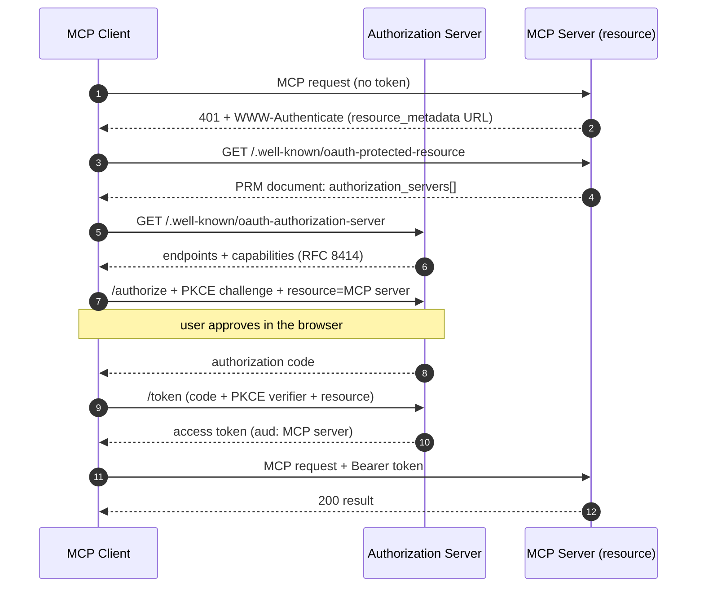
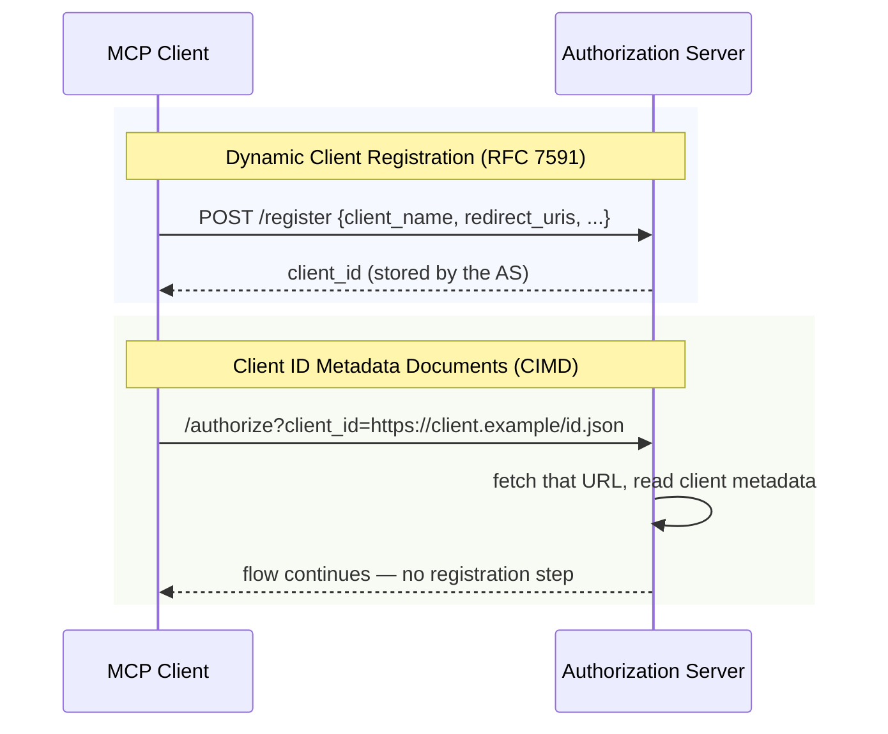
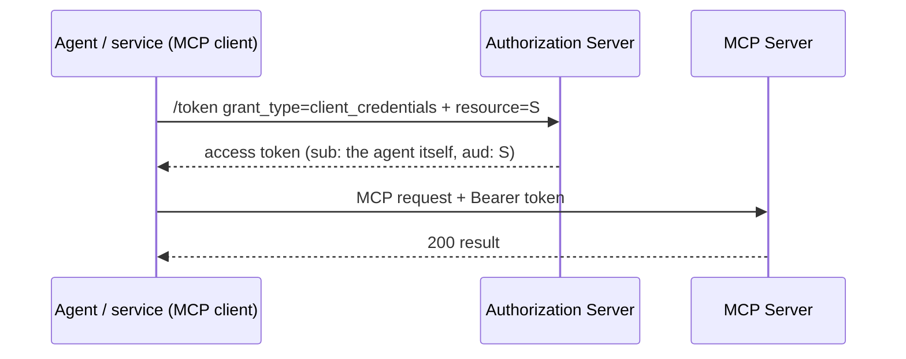
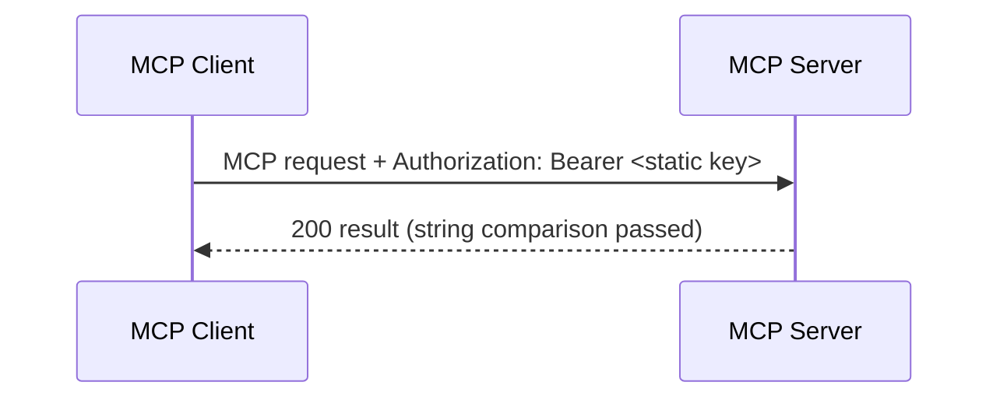
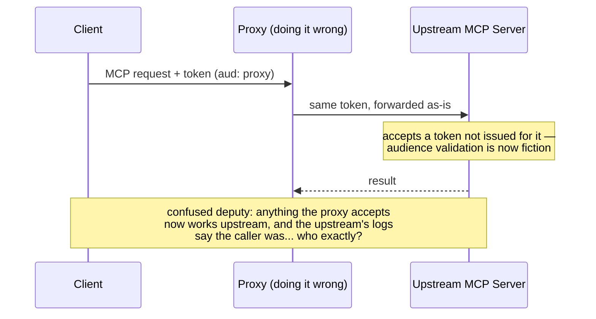
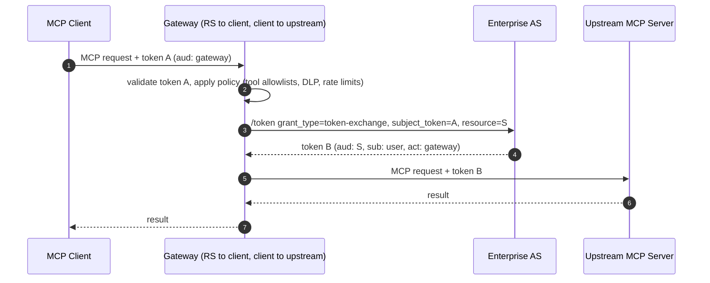
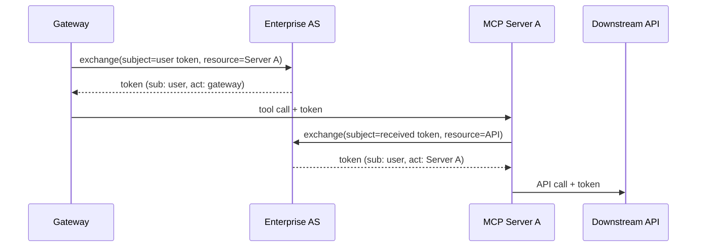
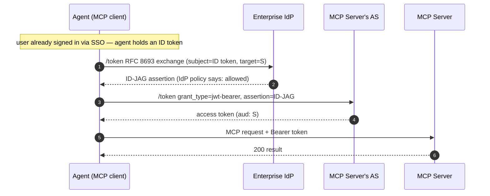

+++
date = '2026-07-04T09:00:00+02:00'
draft = true
title = 'MCP Auth, Explained: Every Method, Direct and Through a Proxy'
author = "Darek Dwornikowski"
categories = ["AI & Engineering"]
tags = ["mcp", "oauth", "security", "ai", "agents"]
description = "A field guide to authentication and authorization in the Model Context Protocol: OAuth 2.1 with PKCE, dynamic client registration, client ID metadata documents, machine-to-machine flows, and what changes when an MCP gateway sits in the middle — token passthrough, token exchange, on-behalf-of chains, and ID-JAG."
+++

Auth is the part of MCP everyone gets wrong first. I know because I build MCP gateways for a living, and the most common support question is some variant of "my client has a token, why won't the server take it?" The answer is almost always the same: the token was minted for someone else.

This post is a field guide. Part one covers how each auth method works when a client talks to an MCP server directly. Part two covers what changes when a proxy — an MCP gateway — sits in the middle, which is where most enterprise deployments end up and where most of the interesting failure modes live. Every method gets a sequence diagram showing who talks to whom and which token moves where.

Here is the canonical flow we will build up to, animated:



## Why MCP auth is weird

Three things make MCP auth harder than ordinary API auth.

**The client acts on behalf of a human, through a model.** When Claude calls your Jira MCP server, the thing holding the token is an agent, not the user. Every design decision downstream — consent screens, audience checks, scope granularity — flows from the question of how much that agent should be allowed to do with the user's identity.

**It is an N×M problem.** Any MCP client is supposed to be able to talk to any MCP server without a human pre-registering the pair. Your OAuth setup at work assumes someone clicked around a developer console and copied a client ID. MCP explicitly does not: clients discover the authorization server at runtime and register (or identify themselves) on the fly.

**The spec moved fast.** Authorization landed in the 2025-03-26 revision, was overhauled in 2025-06-18 (the MCP server became a pure resource server), and extended again in 2025-11-25 (client ID metadata documents, first-class machine-to-machine support). Plenty of servers in the wild implement three different vintages of the spec. Knowing which vintage you are talking to is half the debugging.

One vocabulary note before the flows. Since 2025-06-18 the MCP server is an **OAuth 2.1 resource server**: it consumes tokens, it does not mint them. Minting is the job of an **authorization server** (AS), which may be your IdP, a hosted service, or something the MCP server vendor runs. The client finds out which AS to talk to through discovery, not configuration. That separation is the single most load-bearing fact in this post.

## Part 1: Direct auth — client to MCP server

### OAuth 2.1 authorization code + PKCE

This is *the* MCP auth method — what the spec means when it says authorization. It answers the question: "a human wants this agent to use this server, with the human's permissions."

The flow has two halves: discovery, then the OAuth dance itself.

Walking through it:

1. The client calls the server cold and gets a **401 with a `WWW-Authenticate` header** pointing at the server's protected resource metadata (RFC 9728). This is how a client learns, with zero configuration, who can mint tokens for this server.
2. The PRM document lists one or more authorization servers. The client picks one and pulls its metadata (RFC 8414) to find the authorize and token endpoints.
3. Standard OAuth 2.1 authorization code flow: browser pops, user logs in and approves, client gets a code, swaps it for a token. **PKCE is mandatory** — OAuth 2.1 bakes it in, and MCP clients are public clients that cannot keep a secret.
4. The client sends `resource=<MCP server URL>` (RFC 8707 resource indicators) in both the authorize and token requests, so the AS mints a token **audience-bound to that specific server**.

That last point is the one people skip and regret. The MCP server must validate that the token's audience is itself and reject anything else. A token for `mcp.github.com` presented to `mcp.linear.app` has to bounce, even if the same AS signed both. Audience binding is what makes everything in part two either safe or catastrophic.

**Gotchas:** the browser round-trip means this flow needs a human at least once (refresh tokens carry you afterwards); token lifetime versus long-running agent sessions is an unsolved annoyance; and many servers still ship the 2025-03 pattern where the MCP server is its own AS — clients need to handle the fallback.

### Getting a client_id: DCR vs CIMD

The flow above quietly assumed the client already has a `client_id` at the AS. In the N×M world it usually does not. Two mechanisms fix that.

**Dynamic Client Registration** (RFC 7591) was the original answer: before the first authorize call, the client POSTs its own metadata to the AS and receives a `client_id`. It works, but every AS accumulates an unbounded pile of anonymous registrations, one per client install. Nobody can tell "Claude Desktop" from "claude-desktop-totally-legit". AS operators hate it.

**Client ID Metadata Documents** take a different tack, adopted in the 2025-11-25 spec revision as the recommended path: the `client_id` *is* an HTTPS URL, controlled by the client's vendor, pointing at a JSON document describing the client (name, redirect URIs, logo). The AS fetches it on first sight. No registration call, no database of ghosts, and the client's identity is anchored to a domain someone owns. Claude's client ID can literally be a URL on an Anthropic domain — spoofing it means controlling that domain.

**Gotchas:** CIMD shifts trust to DNS and TLS — fine, that is the same trust the web runs on — but the AS must fetch and cache sanely, and redirect URI validation against the fetched document is where implementations get sloppy. DCR remains the fallback when the AS does not speak CIMD; real clients implement both and try CIMD first.

### Machine-to-machine: client credentials

Not every MCP call has a human behind it. CI pipelines, scheduled agents, service-to-service automation — the agent *is* the principal. OAuth has had the answer since forever: the **client credentials grant**. The 2025-11-25 revision made it an explicit, first-class option for MCP.

No browser, no consent screen, no user. The agent authenticates to the AS with its own credential — a client secret, or better, a signed JWT or workload identity (SPIFFE, cloud instance identity) so no long-lived secret sits on disk — and gets a token whose subject is the agent itself.

The important shift is in authorization semantics: there is no user's permissions to inherit, so **the agent needs its own permission model**. "What is this workload allowed to do" is an access-control-list question your AS or server has to answer directly. This is exactly the space where agent-identity work is heating up: agents as first-class principals in the IdP, with their own lifecycle, not service accounts wearing a trench coat.

**Gotchas:** audience binding still applies — mint per-resource tokens, do not share one token across servers. And resist the urge to run "user-ish" flows through client credentials because the browser hop is annoying; you lose the entire audit story of who asked for what.

### Reality check: static API keys

The spec-pure story above is not what half the ecosystem ships. A huge fraction of MCP servers — especially stdio servers running locally — take a static API key from an environment variable, or accept a hardcoded bearer token over HTTP.

For a **stdio server on your own machine**, this is fine and the spec agrees: transport-level OAuth does not apply to stdio; credentials come from the environment. The server runs with your OS user's privileges anyway.

For a **remote HTTP server**, a static key is a downgrade with real costs: no expiry, no scoping, no audience, no revocation short of rotating the key everywhere, and no identity — everyone with the key is the same caller. It persists because it is fifteen minutes of work. If you must ship it, ship it as a stopgap: per-client keys, scoped, rotatable, and log which key did what. Then put OAuth in front later — or, as we are about to see, let a gateway do it for you.

## Part 2: Auth through an MCP gateway

Enterprises do not let hundreds of laptops negotiate OAuth with dozens of third-party MCP servers independently. They put a **gateway** in the middle: one place to enforce policy, audit calls, allowlist servers and tools, and keep upstream credentials off endpoints. Architecturally the gateway is both an **MCP server** (facing clients) and an **MCP client** (facing upstreams) — and that dual role is precisely what makes its token handling interesting.

There is one wrong way and several right ways.

### Token passthrough: the anti-pattern

The tempting shortcut: client sends a token, gateway forwards the same token upstream.

The MCP security best practices document forbids this outright: an MCP server **must not accept tokens that were not explicitly issued for it**, and a proxy must not pass through what it received. The reasons are classic:

- **Audience collapse.** The whole point of `aud` is that a token stolen from (or issued for) context A is useless in context B. Passthrough deletes that property for every server behind the proxy.
- **Confused deputy.** The upstream makes authorization decisions based on a token minted under assumptions the proxy has silently changed. Downstream trust decisions get made against the wrong principal.
- **Audit destruction.** Upstream logs show the original token's subject, but the request path, policy decisions, and any rewriting the proxy did are invisible. Nobody can reconstruct who actually caused an action.

If you take one rule from this post: **a token crosses exactly one trust boundary — the one it was minted for.** Every hop after that needs a new token. Which brings us to how gateways do it properly.

### Terminate and re-mint: token exchange

The correct gateway pattern. The gateway **terminates** the client's token — validates it, applies policy, and ends that token's journey — then obtains a *new* token for the upstream call via **RFC 8693 token exchange**.



Look at token B's claims: `sub` is still the user — identity is preserved — but `aud` is now the upstream server and an `act` (actor) claim records that the gateway did the exchange. The upstream can make correct authorization decisions *and* the audit trail shows the full delegation chain. Token B can also be **scoped down**: the user's gateway token might be broad, but the token sent to the Jira server carries only Jira scopes. Blast radius shrinks at every hop.

**Gotchas:** the upstream's AS must actually support token exchange and trust the gateway as an exchange client — this is where "works in the demo" meets "our IdP doesn't allow that grant". Exchanged-token caching is a real performance lever (one exchange per user-server-scope tuple, not per request) but cache keyed wrong becomes a cross-user token mixup, the worst bug an MCP gateway can have. When the upstream is a third-party server with its own AS, the gateway may instead hold a per-user upstream token from a one-time consent flow and *select* rather than exchange — same termination principle, different mint.

### On-behalf-of chains

Token exchange composes. When an MCP server is itself a client of something else — server A calls a downstream API to answer the tool call — it repeats the same move: exchange the token it received for one aimed at the next hop.

Each token in the chain keeps `sub` = user and appends to the actor chain. That is **delegation** — everyone downstream can see both who the request is for and which services touched it. Contrast with **impersonation**, where the intermediary gets a token that simply *is* the user with no trace of the middleman; RFC 8693 supports both, and for MCP you almost always want delegation, because "an AI agent did this via two intermediaries" is precisely the thing your security team wants visible in logs.

The practical limit is trust topology: every hop's AS must know about every exchanger. Inside one enterprise with one AS, easy. Across organizations, hard — which is the gap the next pattern targets.

### ID-JAG: cross-app access

The newest piece, and the one aimed squarely at the enterprise MCP problem: **Identity Assertion Authorization Grant** (ID-JAG, an IETF OAuth working group draft, marketed by Okta as "Cross App Access"). The pitch: the user already SSO'd into the enterprise IdP once. Instead of every MCP server running its own consent-screen OAuth dance with every client — N×M browser popups, each an approval decision made by a possibly consent-fatigued user — the IdP becomes the single policy point that hands out cross-app access.



Two exchanges, two trust relationships: the agent trades its **ID token** to the IdP for an **ID-JAG assertion** (this is where enterprise policy runs — which users, which agents, which servers), then trades the assertion to the MCP server's AS for an **access token**. The server-side AS trusts the enterprise IdP's signature the way SAML federations always have; the flow is the OAuth-native descendant of that idea.

What this buys an enterprise is exactly what consent screens cannot: **centralized, revocable, auditable** decisions about which agents reach which MCP servers, made by an admin, not by whichever user clicked "Allow" fastest. Turn off a user in the IdP, and their agent access dies everywhere at once.

**Gotchas:** it is a draft — implementations exist (IdP vendors are racing) but expect churn; both your IdP and the MCP server's AS must support it, so today it shines inside ecosystems where one party controls both ends; and it deliberately answers *authentication and reachability*, not fine-grained authorization — you still scope tokens per resource like everywhere else in this post.

## Choosing: the table

| Method | Human involved | Identity in token | Pre-registration | Policy lives at | Status |
|---|---|---|---|---|---|
| OAuth 2.1 + PKCE | Yes, consents in browser | User | No (DCR/CIMD) | AS + consent screen | Spec, required for HTTP |
| DCR (RFC 7591) | — | — | Self-service at runtime | AS | Spec, fallback |
| CIMD | — | — | None: client_id is a URL | AS + client's domain | Spec 2025-11, recommended |
| Client credentials | No | The agent itself | Client credential setup | AS / server ACLs | Spec 2025-11 |
| Static API key | No | Whoever holds the key | Manual | Nowhere useful | Ubiquitous, off-spec |
| Token passthrough | — | Lies | — | — | Forbidden |
| Terminate + exchange | Once, at the edge | User, with actor chain | Gateway as AS client | Gateway + AS | RFC 8693, the gateway pattern |
| OBO chain | Once | User, full delegation chain | Every hop at the AS | AS | RFC 8693 |
| ID-JAG | SSO only, no consent screens | User, IdP-asserted | Federation setup | Enterprise IdP | IETF draft |

## Takeaways

1. **Audience binding is the spine of MCP auth.** Every safe pattern in this post is a variation on "mint a fresh token per trust boundary"; the one forbidden pattern is the one that breaks it.
2. **Direct auth is a solved problem on paper** — OAuth 2.1 + PKCE with runtime discovery — and an unevenly implemented one in practice. Check which spec revision your counterparty speaks before debugging anything else.
3. **Gateways do not weaken auth; done right, they strengthen it.** Terminate and re-mint gives you scoped-down tokens, actor chains, and one audit point — none of which N independent clients would give you.
4. **The enterprise endgame is IdP-centered.** Client credentials for headless agents, ID-JAG for user-driven ones, both governed where enterprises already govern everything else. The consent screen is quietly on its way out of the enterprise MCP story.

If you are building a client: implement discovery properly, CIMD first, DCR fallback, and never cache a token across resources. If you are building a server: be a resource server, validate audience, publish honest PRM. If you are deploying a fleet of either: put a gateway in the middle and make it exchange tokens, not forward them. The protocol finally has the pieces; the failure modes are all in skipping one.
